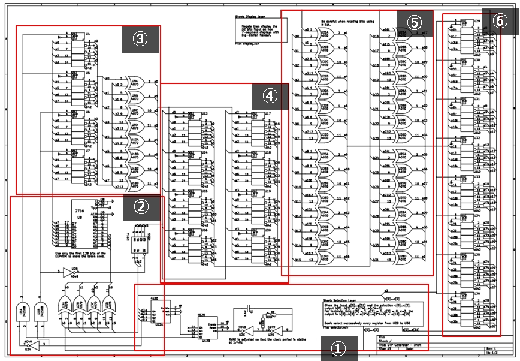

# NuitDuHack2013 misc400 write-up

## Q

```
OMG, electronics ...

Found some information about what seems to be an OTP. And a webpage asking for a valid token. 
The design draft we retrieved looks terrible, they must have got it fixed, yet the algorithm should be similar.

Score
    400
Link
    http://z0b.nuitduhack.com:8001/
Attachments
    Design draft    Test report
```

## Sovler

solver_opt.py



## Implementation OPT for arduino

arduino_otp/
